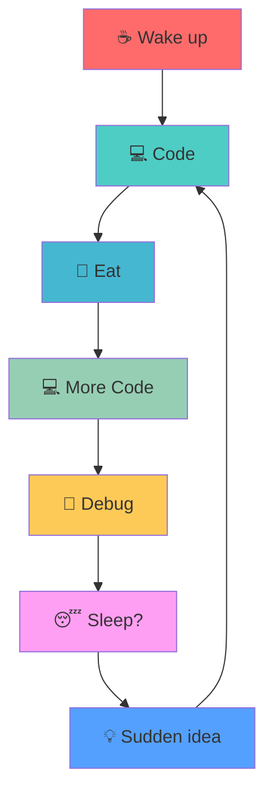

```
 ____                     ____                              _      
|  _ \ __ _ _ __ ___       / ___|  __ _ _ ____      ____ _  __| | ___ 
| |_) / _` | '_ ` _ \      \___ \ / _` | '__\ \ /\ / / _` |/ _` |/ _ \
|  _ < (_| | | | | | |      ___) | (_| | |   \ V  V / (_| | (_| |  __/
|_| \_\__,_|_| |_| |_|     |____/ \__,_|_|    \_/\_/ \__,_|\__,_|\___|
```

<div align="center">

```javascript
class RamSarwade {
    constructor() {
        this.name = "Ram Sarwade";
        this.role = "Full-Stack Wizard 🧙‍♂️";
        this.location = "Aurangabad, Maharashtra, India 🇮🇳";
        this.college = "Government College of Engineering, Aurangabad";
        this.currentFocus = ["System Design", "Competitive Programming", "Building Cool Stuff"];
        this.funFact = "I debug with console.log() and I'm not ashamed! 😅";
    }

    getCurrentStatus() {
        return {
            coding: "24/7",
            learning: "Always",
            collaborating: "Open for opportunities",
            coffee: "☕ Addiction Level: Maximum"
        };
    }

    getAchievements() {
        return [
            "🏆 TCS CodeVita S12 Global Rank 267 (Top 0.01%)",
            "🔥 350+ Day LeetCode Streak (Still going strong!)",
            "⭐ CodeChef 2★ | Global Rank 52 in Starters 193",
            "💡 1000+ DSA Problems Conquered",
            "🎯 Goldman Sachs Engineering Simulation Complete"
        ];
    }
}

const ram = new RamSarwade();
console.log("Welcome to my digital universe! 🚀");
```

</div>

---

## 🎮 **Current Game Stats**

<table>
<tr>
<td>

```yaml
Player: Ram Sarwade
Class: Full-Stack Developer
Level: Undergraduate++
XP: 1000+ Problems Solved

Stats:
  🧠 Intelligence: ████████░░ 80%
  ⚡ Speed: ███████░░░ 70% 
  🎯 Accuracy: ████████░░ 85%
  🔄 Persistence: ██████████ 100%
  ☕ Coffee Dependency: ██████████ 100%

Current Quest: Building Scalable Applications
Side Missions: Open Source Contributions
```

</td>
<td>

```python
# My Coding DNA 🧬
coding_dna = {
    'languages': {
        'fluent': ['C++', 'JavaScript', 'C'],
        'learning': ['Python', 'TypeScript'],
        'want_to_learn': ['Rust', 'Go']
    },
    'superpowers': [
        'Turning coffee into code',
        'Debugging at 3 AM',
        'Making APIs that actually work',
        'Writing clean(ish) code'
    ],
    'kryptonite': ['Merge conflicts', 'CSS centering'],
    'motto': 'Code, Debug, Coffee, Repeat 🔄'
}
```

</td>
</tr>
</table>

---

## 🛠️ **My Arsenal** 

<div align="center">

### **⚔️ Weapons of Choice**
```
Frontend:  [████████████████████] React.js + Tailwind CSS
Backend:   [██████████████████░░] Node.js + Express.js  
Database:  [███████████████░░░░░] MongoDB + MySQL
Tools:     [████████████████░░░░] Git + VS Code + Postman
```

### **🏆 Battle-Tested Technologies**


</div>

---

## 🚀 **Mission Control: Featured Projects**

### 🎯 **[QR-Based Attendance System](https://github.com/s-ram-1818/QRBasedAttendanceSystem)**
```diff
+ Role-based authentication system
+ Real-time QR code generation & scanning
+ Admin dashboard with analytics
+ JWT token management
+ Responsive React.js frontend
! Tech Stack: React.js | Node.js | Express.js | MongoDB | JWT
```

### 📰 **[GECA News Updates](https://github.com/s-ram-1818/GECA-News-Updates)**
```diff
+ Web scraping with Cheerio.js
+ Google OAuth integration
+ Automated email notifications
+ Cron job scheduling
+ Email verification system
! Tech Stack: Node.js | Express.js | MongoDB | Nodemailer
```

---

## 📈 **Performance Metrics**

<div align="center">
  
```
                    🏅 ACHIEVEMENTS UNLOCKED 🏅
┌─────────────────────────────────────────────────────────────┐
│  Achievement                        │  Status   │  Rarity   │
├─────────────────────────────────────┼───────────┼───────────┤
│  TCS CodeVita Global Rank 267      │    ✅     │  Legendary│
│  350+ Day LeetCode Streak           │    ✅     │    Epic   │
│  CodeChef 2★ Rating                 │    ✅     │    Rare   │
│  1000+ Problems Solved              │    ✅     │  Uncommon │
│  Goldman Sachs Simulation           │    ✅     │  Uncommon │
└─────────────────────────────────────┴───────────┴───────────┘
```


</div>

---

## 🎯 **Coding Battlegrounds**

<div align="center">

| Platform | Handle | Status | Special Achievement |
|:--------:|:------:|:------:|:------------------:|
| 🟡 **LeetCode** | [`s_ram_1818`](https://leetcode.com/s_ram_1818/) | 🔥 350+ Day Streak | Daily Problem Warrior |
| 🟢 **GeeksforGeeks** | [`s_ram_1818`](https://www.geeksforgeeks.org/user/s_ram_1818/) | 💡 Active Solver | Knowledge Seeker |
| 🟠 **CodeChef** | [`s_ram_108`](https://www.codechef.com/users/s_ram_108) | ⭐ 2★ (1553) | Global Rank 52 |

</div>

---

## 🌐 **Connect & Collaborate**

<div align="center">

```ascii
     📧 Email me          💼 LinkedIn         🐙 GitHub
ramsarwade1818@gmail.com  │  linkedin.com/in/ram1818  │  github.com/s-ram-1818
```

[](mailto:ramsarwade1818@gmail.com)
[](https://www.linkedin.com/in/ram1818/)
[](https://github.com/s-ram-1818)

</div>

---

## 🎭 **Easter Eggs & Fun Facts**

<details>
<summary>🎲 Click to reveal my secrets...</summary>

```python
personal_quirks = {
    "coding_hours": "Usually 2 AM - 6 AM (Night owl 🦉)",
    "debugging_style": "Print statements everywhere + frustrated sighs",
    "favorite_error": "Cannot read property 'undefined' of undefined",
    "code_review_style": "\"This looks good\" *internally screaming*",
    "git_commit_messages": ["fix", "works", "idk why this works but it does"],
    "productivity_hack": "Lo-fi hip hop beats + mechanical keyboard",
    "dream_project": "Building the next unicorn startup 🦄",
    "coding_fuel": "☕ Coffee + 🍕 Pizza + 💤 Minimal sleep"
}

# Secret achievement unlocked: You found this section! 🏆
print("Thanks for exploring my profile! Let's build something amazing together! 🚀")
```

</details>

---

## 🎪 **Current Circus Acts**



---

<div align="center">

**🎯 Mission Statement**
> "Converting caffeine into clean code, one algorithm at a time!"

```
⭐ Star my repos if you find them useful!
🔔 Watch for updates on cool projects!
🤝 Always open to collaboration and crazy ideas!
```


---

```
  ______ _   _ _____   ____  ______   ______ _____ _      ______ 
 |  ____| \ | |  __ \ |  _ \|  ____| |  ____|_   _| |    |  ____|
 | |__  |  \| | |  | | | |_) | |__    | |__    | | | |    | |__   
 |  __| | . ` | |  | | |  _ <|  __|   |  __|   | | | |    |  __|  
 | |____| |\  | |__| | | |_) | |      | |     _| |_| |____| |____ 
 |______|_| \_|_____/  |____/|_|      |_|    |_____|______|______|
```

</div>
